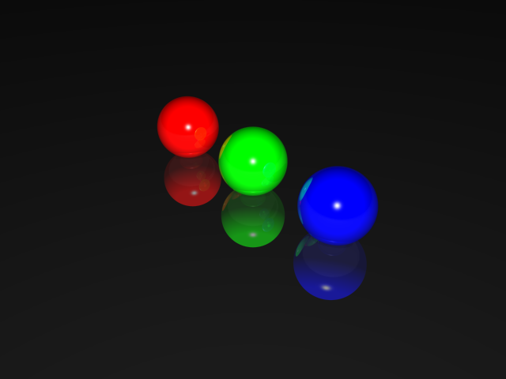

# Raytracer

This is a self programmed Raytracer to simulate 3D scenarios.

## How does it work
The Raytracer sends rays and calculates how the visibility of a 3D objects is, seen from a specific point in a room.

## Important features
The most important features are:

* Motion Blur-Effect
* Refraction
* Reflection
* Texturing
* Shadow calculation
* Transformation

## Testing
All tests are defined in the folder **src > testing**.

There are the following tests available:

* DOF Camera (TestDOFCamera)
* Motion Blur (TestMotionBlurCamera)
* Reflection (TestReflection)
* Refraction (TestRefraction)
* Sampling (TestSampling)
* Multithreading (TestMultithreading_RayTracer)
* Shadow (TestShadow)
* Transformations (TestTransformation)
* Object Tests for spheres, surfaces, cubes (TestRayTracer)

